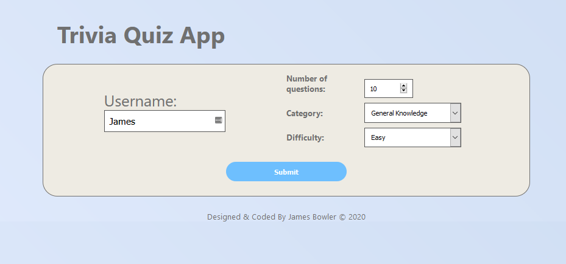
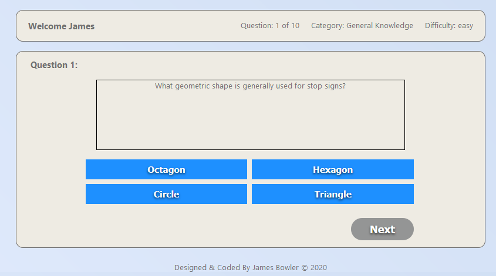
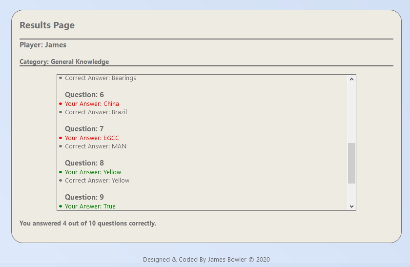

# Trivia Quiz App

A project built while learning how to use fetch and work with public api's while learning with the School of Code.

This project uses the [Open Trivia DB](https://www.google.com "Open Trivia DB API") api to fetch a selection of questions based on the selections the user makes for both category and difficulty.

This is basic HTML5 CSS3 & JavaScript learning project.

### To Start:

1. Recommend running with live server in VsCode.

##### Screenshots:

1.  

2.  

3.  
